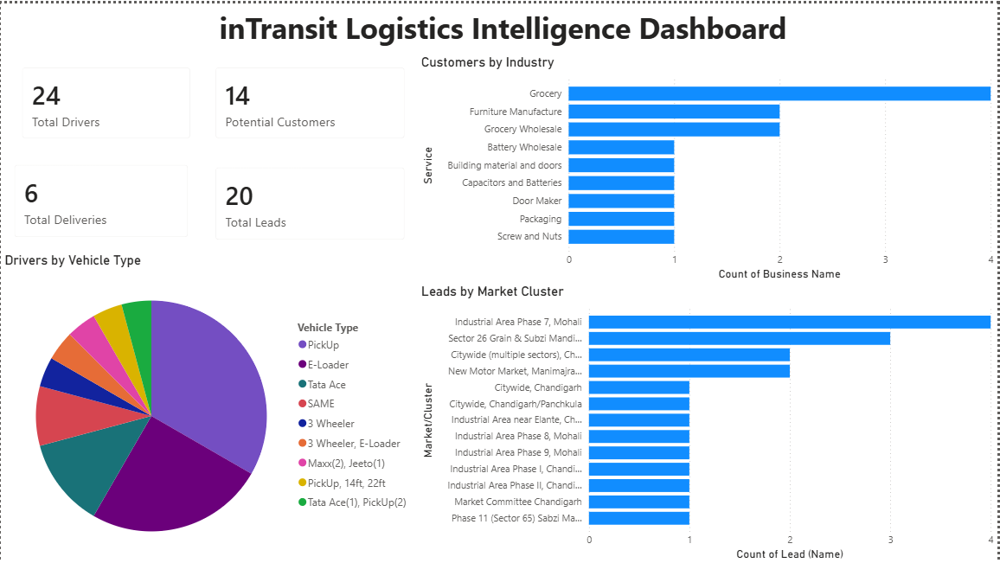
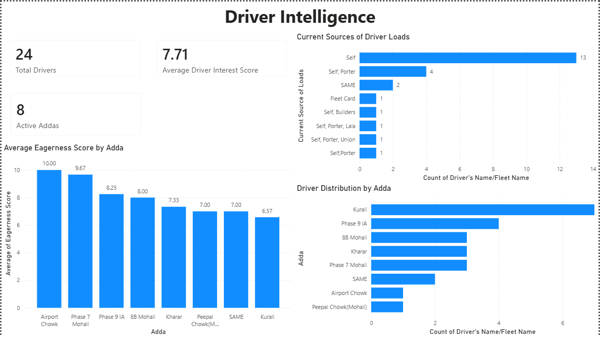
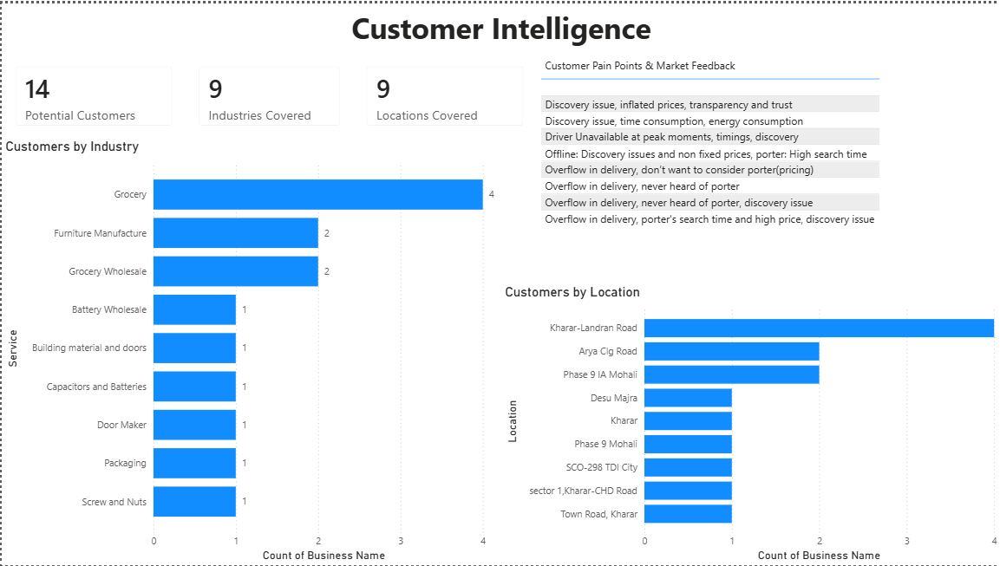
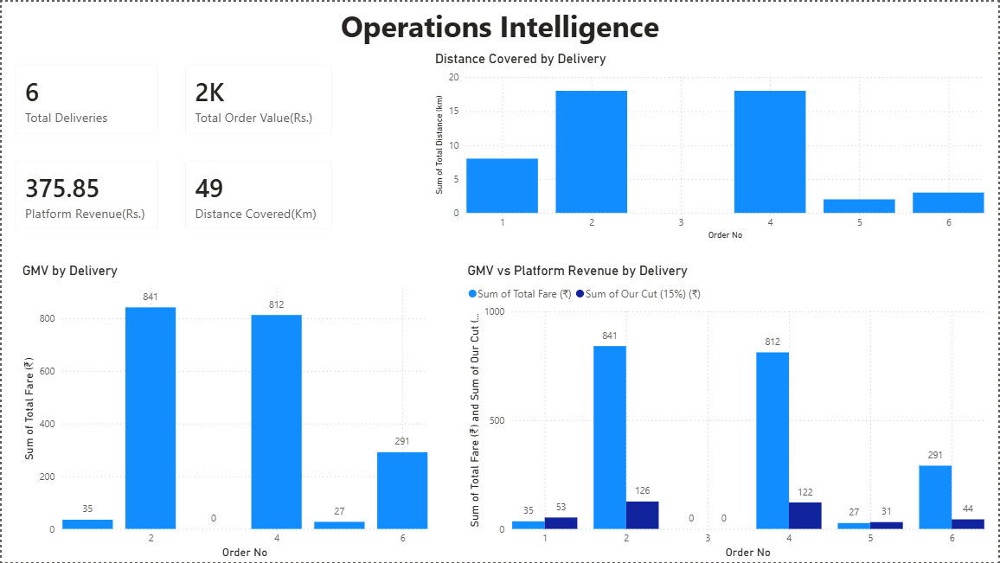

# Logistics Intelligence Dashboard

## Overview

A business intelligence dashboard built using Power BI to analyze logistics operations, driver acquisition, customer research, delivery performance, and platform revenue metrics.

The dashboard is based on real logistics market research conducted across Chandigarh, Mohali, and Panchkula and provides actionable insights for operations and business teams.

---

## Key Features

* Executive Overview with operational KPIs
* Driver Intelligence and engagement analysis
* Customer Intelligence and pain-point analysis
* Operations Intelligence and revenue tracking
* 14 KPIs and interactive visualizations
* Multi-dataset business analytics framework

---

## Technology Stack

* Power BI
* Microsoft Excel
* CSV Data Sources
* Data Modeling
* Business Analytics

---

## Dashboard Pages

### Executive Overview

Provides a high-level summary of drivers, customers, deliveries, and market opportunities.

---

### Driver Intelligence

Analyzes driver distribution, acquisition channels, operational clusters, and eagerness scores.

---

### Customer Intelligence

Identifies customer segments, industry concentration, geographic clusters, and customer pain points.

---

### Operations Intelligence

Tracks deliveries, GMV, platform revenue, and operational performance.

---

## Business Insights Generated

* Identified key customer industries for logistics acquisition.
* Analyzed driver engagement across operational hubs.
* Evaluated customer pain points affecting marketplace adoption.
* Measured platform revenue and delivery performance.
* Highlighted regional demand clusters for expansion opportunities.

---

## Author

Anshit Sharma
